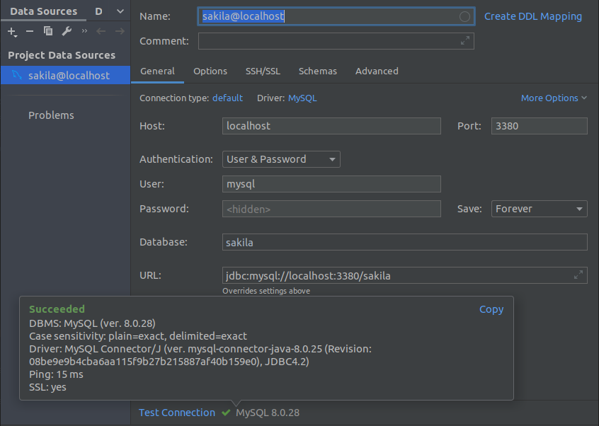

# Учебный проект на MySQL 8.0 с использованием демо-базы Sakila

## Описание и запуск

В этом проекте используется [Sakila Sample Database](https://dev.mysql.com/doc/sakila/en/).

Для инициализации и запуска базы:

```
docker-compose up --build -d
docker exec -i mysql8_p001 sh -c 'exec mysql -uroot -pmysql' < ./sakila-db/sakila-schema.sql
docker exec -i mysql8_p001 sh -c 'exec mysql -uroot -pmysql' < ./sakila-db/sakila-data.sql
docker exec -i mysql8_p001 sh -c 'exec mysql -uroot -pmysql' < ./sakila-db/sakila-grant.sql
```

В дальнейшем для запуска только:

```
docker-compose up -d
```

## Настройка в PhpStorm


