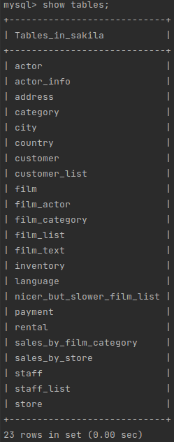
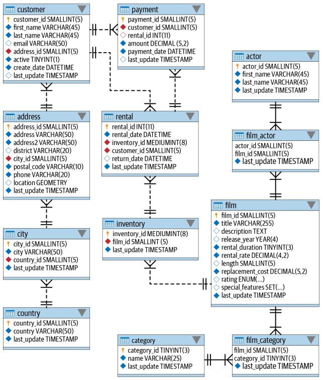

# БД Sakila на MySQL 8.0 для экспериментов и обучения

## Описание и запуск

В этом проекте используется [Sakila Sample Database](https://dev.mysql.com/doc/sakila/en/).

Для инициализации и запуска базы:

```
docker-compose up --build -d
docker exec -i mysql8_p001 sh -c 'exec mysql -uroot -pmysql' < ./sakila-db/sakila-schema.sql
docker exec -i mysql8_p001 sh -c 'exec mysql -uroot -pmysql' < ./sakila-db/sakila-data.sql
docker exec -i mysql8_p001 sh -c 'exec mysql -uroot -pmysql' < ./sakila-db/sakila-grant.sql
```

В дальнейшем для запуска только:

```
docker-compose up -d
```

## Настройка в PhpStorm


## Запуск и использование консоли MySQL

Войти в консоль MySQL с выбранной БД `Sakila` можно с помощью следующей команды (Docker compose должен быть запущен):

```
docker exec -it mysql8_p001 mysql -umysql -pmysql sakila
```

## База данных Sakila

Список таблиц в БД:

- actor
- actor_info
- address
- category
- city
- country
- customer
- customer_list
- film
- film_actor
- film_category
- film_list
- film_text
- inventory
- language
- nicer_but_slower_film_list
- payment
- rental
- sales_by_film_category
- sales_by_store
- staff
- staff_list
- store




